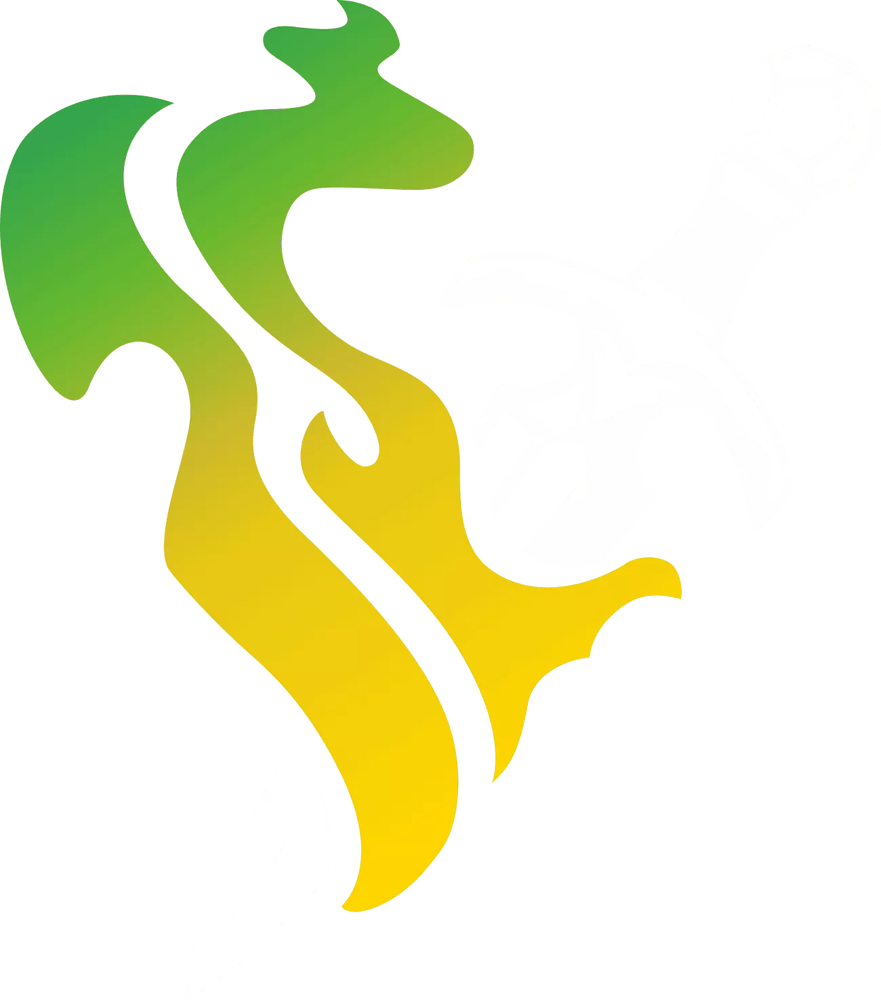

   
  

  
   
  
   
  
  

# Daggerheart-BR

Tradução **Brasileira** completa para o sistema **Daggerheart** (Foundryborne) no
Foundry VTT — interface, itens de compêndio e um conjunto de automações extras
pensadas pra deixar a mesa mais rápida de rodar. Sem inventar: a
prioridade é ficar o mais próximo possível do original.

---

## Índice

- [Filosofia de tradução](#filosofia-de-tradução)
- [O que vem no módulo](#o-que-vem-no-módulo)
  - [Interface traduzida](#interface-traduzida)
  - [Compêndios](#compêndios)
  - [Conteúdo caseiro incluso (Homebrew)](#conteúdo-caseiro-incluso-homebrew)
  - [Automações e recursos extras](#automações-e-recursos-extras)
- [Instalação](#instalação)
- [Dependências obrigatórias](#dependências-obrigatórias)
- [Compatibilidade](#compatibilidade)
- [O que NÃO está pronto nesta versão](#o-que-não-está-pronto-nesta-versão)
- [Avisos de estabilidade](#avisos-de-estabilidade)
- [Problemas conhecidos / passos manuais](#problemas-conhecidos--passos-manuais)
- [Documentação técnica](#documentação-técnica)
- [Créditos e licença](#créditos-e-licença)

---

## Filosofia de tradução

- Sem "Pontos de" — o texto fica mais limpo e mais perto do tom literário original
  ("Esperança", não "Pontos de Esperança").
- Preserva construções que remetem à ficha física — "marque uma Esperança",
  "limpe um Estresse" — porque é assim que o material original fala com quem
  joga.
- Termos revisados quando a tradução oficial parecia duvidosa (ex.: "Fadiga").
- Sem inventar, só traduzir. Conforme está no original; só o idioma muda.

## O que vem no módulo

### Interface traduzida

Todo o sistema — fichas, diálogos, configurações, chat — traduzido pro
Brasileiro. Sem strings em inglês conhecidas restantes.

### Compêndios

Todos os compêndios de criação de personagem estão traduzidos:

| Compêndio | Conteúdo |
|---|---|
| Ancestralidades | COMPLETO |
| Comunidades | COMPLETO |
| Classes e Subclasses | COMPLETO |
| Domínios | COMPLETO |
| Armas | COMPLETO |
| Armaduras | COMPLETO |
| Consumíveis & Tesouros | COMPLETO |

### Conteúdo "Homebrew"

Registrado automaticamente ao carregar o mundo (não precisa configurar nada):

- **Domínios extras**: Sangue & Curinga.
- **Tipo de Adversário extra**: Colosso.
- **Fontes de atribuição**: "Hope & Fear" e "The Void"

### Automações e recursos extras

Além da tradução, o módulo inclui scripts próprios que mudam/aceleram parte do
fluxo de jogo. Cada um tem documentação técnica detalhada linkada
(veja [Documentação técnica](#documentação-técnica)):

| Recurso | O que faz |
|---|---|
| **Botões rápidos de Dano/Cura** | Aplicar dano/cura em 1 clique, com variantes 2x e ½, direto no card de rolagem |
| **Ações no dado individual** | Rerolar, Dobrar, Rolar +N ou Remover um dado específico do total, ao clicar nele |
| **Prestar Ajuda** | Botão "Ajudar" em qualquer rolagem de Ação/Ataque/Reação — gasta 1 Esperança pra somar um dado ao resultado de um aliado |
| **Transformação** | Desenvolvido antes da nova versão, mantida pra evitar quebra até revisão completa |
| **Automação de Recursos Extras** | Faz Actions de itens diferentes conseguirem debitar/restaurar o recurso de um item "gerador" — contorna uma limitação nativa do sistema |
| **Oculto ↔ Escondido** | Vincula automaticamente o efeito da carta "Oculto" à condição nativa "Escondido" |
| **Mais automações e chaves customizadas** | Conjunto de flags de Active Effect pra homebrew de poderes (ver tabela detalhada no link da documentação) |

## Instalação

Manifest:
https://raw.githubusercontent.com/raposoel/DH-BR/refs/heads/main/module.json

1. No Foundry, aba **Add-on Modules** → **Install Module** → cole o manifest acima.
2. Instale também as [dependências obrigatórias](#dependências-obrigatórias).
3. No seu Mundo, ative `daggerheart-br`, **Babele** e **libWrapper**.
4. Configuração → Idioma → selecione **Português (Brasil)**.

## Dependências obrigatórias

| Módulo | Por quê |
|---|---|
| [Babele](https://foundryvtt.com/packages/babele) | Traduz o conteúdo em tempo de execução |
| [libWrapper](https://foundryvtt.com/packages/lib-wrapper) | Necessário para as automações extras |

## Compatibilidade

- **Foundry VTT**: v14
- **Sistema Daggerheart (Foundryborne)**: verificado para v2.9.2

## O que NÃO está pronto nesta versão

Ainda pendentes pra uma cobertura 100% do sistema:

- Bestiários (Adversários e Ambientes)
- Diários
- Tabelas de Rolagem

## Problemas conhecidos / passos manuais

- **Forma de Fera do Druida**: por limitação do sistema, é preciso mover
  manualmente as pastas do compêndio de Formas de Fera pra aba de Itens do
  Mundo (não funciona direto do compêndio). Guia com prints no repositório.
- **Invocações**: pra personalizar uma invocação, copie a pasta correspondente
  do compêndio pra aba de Atores e edite a partir daí — o sistema não permite
  duplicar/referenciar sem esse passo. Dê Ownership aos jogadores na pasta.
- Recomendado: apague os compêndios oficiais de "Character Options" em inglês
  do seu mundo, se possível, pra evitar duplicidade na hora de criar
  personagem. Há uma macro para isso no compêndio do módulo.

## Documentação técnica

Pra quem quiser entender o funcionamento interno de cada script (ou dar
manutenção depois de um update do sistema):

VEM AÍ

<!-- // - `APRENDIZADOS-daggerheart-br.md` — packs, schema de itens, Homebrew, metodologia de tradução
// - `README-transformacao.md` — o item Transformação
// - `README-dano-cura.md` — botões de Dano/Cura e Prestar Ajuda
// - `README-matanza.md` — Dado de Matança e as demais flags de Active Effect
// - `README-recursos.md` — automação de recursos vinculados (Foco/Favor/etc.) -->

## Créditos e licença

- **Código deste módulo**: **MIT**.

- **Conteúdo traduzido**: "Conteúdo Adaptativo" sob os termos da DPCGL 2.0.

Este produto inclui material do **Daggerheart System Reference Document
2.0**, © Critical Role, LLC, sob os termos da Darrington Press Community
Gaming License. Mais informações em https://www.daggerheart.com. "Hope &
Fear" está coberto desde a atualização da DPCGL de 25/08/2026; "The Void" é
material de playtest oficial do Daggerheart — pode ser compartilhado
livremente (o que este módulo faz, de graça), mas **nunca vendido nem
monetizado** enquanto for conteúdo de playtest.

"Daggerheart" é marca registrada de Critical Role, LLC — este projeto é
**"Daggerheart™ Compatible"**, não afiliado nem endossado pela Darrington
Press.

  

